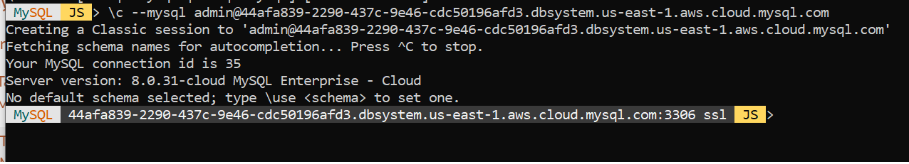
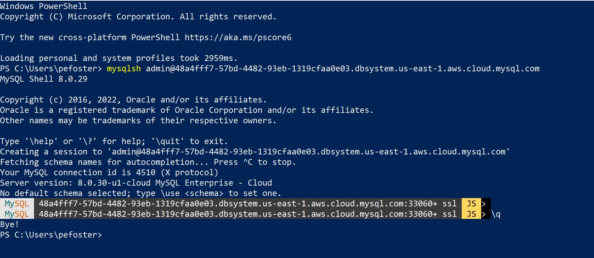

# Connect to and Load your MySQL DB System

## Introduction

In this lab, you will connect to your HeatWave Database using MySQL Shell. Then you will load Sample TPCH Data to the  HeatWave databse system.

_Estimated Lab Time:_ 20 minutes

### Objectives

In this lab, you will be guided through the following tasks:

- Connect MySQL Shell to MySQL
- Load Sample TPCH Data to MySQL DB System

### Prerequisites

- An Oracle Trial or Paid Cloud Account
- Some Experience with MySQL Shell
- Must Complete Lab 1

## Task 1: Connect MySQL Shell to MySQL

1. After the DB system reaches ‘Active’ state (green), click on the DB system name and copy your DB system end-point under the the ‘Host Name’ value.

2. You can access the MySQL DB system using the host name and the admin user
credential from any client machine. MySQL Shell 8.0 is required. On a command
prompt, connect to MySQL

    ```bash
    <copy>mysqlsh <username>@<MySQL Host Name> --mysql</copy>
    ```

    **For example:**   mysqlsh admin@xxxx.dbsystem.us-east-1.aws.mysqlheatwave.com --mysql

    **NOTE:** Currently only classic MySQL protocol is supported. To connect from
    MySQL Shell via classic protocol, use the option --mysql. 
    
    For more details see: [MySQL Shell guide] (<https://dev.mysql.com/doc/mysql-shell/8.0/en/mysqlsh.html>)

3. You are now connected to MySQL and are ready to import data to MySQL.

    

    To exit enter

    ```bash
    <copy>\q</copy>
    ```

    **NOTE:**  When using MySQL Shell to test HW on AWS, your Shell prompt will display the AWS host name, which is really long.  
    So, here is how to change the MySQL Shell prompt (see [mysql-shell-prompt-themes.html]  (https://dev.mysql.com/doc/mysql-shell/8.0/en/mysql-shell-prompt-themes.html) )

    - a. Copy one of the prompt files to your $HOME/.mysqlsh directory: 

        ```bash
        <copy> cp /usr/local/mysql-shell/share/mysqlsh/prompt/prompt_256.json $HOME/.mysqlsh/prompt_256.json</copy>
        ```
    - b. Edit the $HOME/.mysqlsh/prompt_256.json file, and do a find/replace for %host% - and change to %user%.
    - c. Edit your $HOME/.zshrc file (Z-shell profile) and add this to the bottom: (change the user name to your name)
    - b. Export MYSQLSH_PROMPT_THEME=“/users/tonydarnell/.mysqlsh/prompt_256.json”
    - e. Reload the .zshrc file from the command line: . ./.zshrc

    When you login to Shell, you will get this:  **MySQL  %ssh_user% > root:3306 ssl  JS >** 

    Instead of something like this: **MySQL  %ssh_user% > 73d844c4-186d-4dc1-8322-e93a93f79d13.dbsystem.us-east-1.aws.cloud.mysql.com:3306 ssl  JS >**

## Task 2: Load Sample TPCH Data to MySQL DB System

1. Connect to the MySQL DB system

    ```bash
    <copy>mysqlsh <username>@<MySQL Host Name> --mysql</copy>
    ```

2. Load TPCH sample data file (10GB of data)

     ```bash
    <copy>util.loadDump("https://objectstorage.us-ashburn-1.oraclecloud.com/p/PzqvBnIYvbeBdREgv0u85H-XXOjXdX2UxrpkGI76BwfCvaqc06wFnEmlipzx9msR/n/idazzjlcjqzj/b/tpch/o/tpch10g/",{progressFile: "progress.json",threads: 16})</copy>
    ```

    

3. View tpch database

    a.

    ```bash
    <copy>\sql</copy>
    ```

    b.

    ```bash
    <copy>SELECT table_name, table_rows FROM INFORMATION_SCHEMA.TABLES WHERE TABLE_SCHEMA = 'tpch';</copy>
    ```

## Acknowledgements

- **Author** - Perside Foster, MySQL Solution Engineering

- **Contributors** - Mandy Pang, Principal Product Manager,
Nick Mader, MySQL Global Channel Enablement & Strategy Manager
- **Last Updated By/Date** - Perside Foster, MySQL Solution Engineering, September 2022
