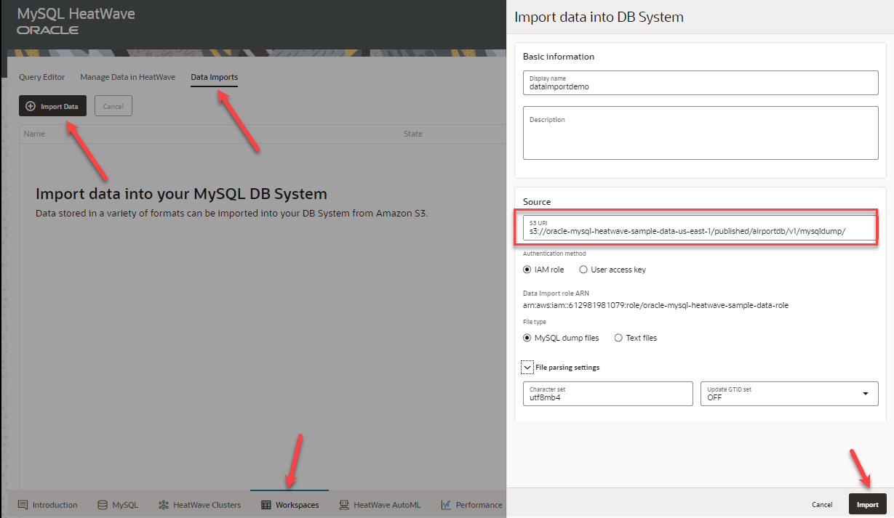

# Connect to and Load your MySQL HeatWave System

## Introduction

In this lab, you will connect to your HeatWave Database System and load data into it


_Estimated Lab Time:_ 10 minutes

### Objectives

In this lab, you will be guided through the following tasks:

- Connect MySQL HeatWave
- Import Data from Amazon S3
- Load Data into HeatWave

### Prerequisites

- An Oracle Trial or Paid Cloud Account
- Must Complete Lab 1

## Task 1: Connect MySQL HeatWave

MySQL HeatWave provides an easy and quick way to import data from Amazon S3 in either MySQL dump file or text file (such as TSV, CSV) format.
To import the sample data, let us connect to the DB System, MyDBSystem, which is now up and running.

The DB system should show up as **Active** state (green). Perform the following tasks:

1. Click on the **Workspaces** link
2. Click on the **Connect to MySQL DB Ssytem** button
3. Select your HeatWave DB System Name
4. Enter your database username and password

    

## Task 2: Import Data from Amazon S3

You will now import sample data from an Oracle-owned Amazon S3 bucket, which contains the database, airportdb, in MySQL dump file format. For authentication to Amazon S3, you are using the IAM roles, which you had earlier updated while creating the DB System. For authentication use the AWS user access keys.

1. Click on the **Data Imports** link
2. Copy and paste the following command to the source entry

    ```bash
    <copy>s3://oracle-mysql-heatwave-sample-data-us-east-1/published/airportdb/v1/mysqldump/</copy>
    ```

3. Click the **Import** button

    

4. The sample data is imported from S3 into the DB System in MySQL HeatWave on AWS. You can view the errors, warnings and info messages related to the import operation.

    

## Task 3: Load Data into HeatWave Cluster

The imported data is present in the DB System. you will now load the data into the HeatWave Cluster to accelerate query processing. You can select the schemas or tables to load into HeatWave, and get an estimate on the memory and time required to load the data.MySQL HeatWave optimizes the memory usage and load time of the data load operation by predicting the optimal degree of parallelism for the set of tables you have selected to load into HeatWave.

1. Click the **Manage Data in HeatWave** button
2. Click the **Load into HeatWave** button
3. From the MySQL Auto Pilot screen click the **Load Tables** button

    

To provide better visibility into storage and memory usage, the MySQL HeatWave console provides detailed information about the memory size of each table in the HeatWave cluster memory, load status, estimated rows, and so on.

- Final view of the load process:

    

You may now **proceed to the next lab**

## Learn More

- [MySQL HeatWave on AWS Service Guiden](https://dev.mysql.com/doc/heatwave-aws/en/)

- [MySQL Database Documentation](https://dev.mysql.com/)

## Acknowledgements

- **Author** - Perside Foster, MySQL Solution Engineering
- **Contributors** - Mandy Pang, Senior Principal Product Manager, Aijaz Fatima, Product Manager
- **Last Updated By/Date** - Perside Foster, MySQL Solution Engineering, February 2024
