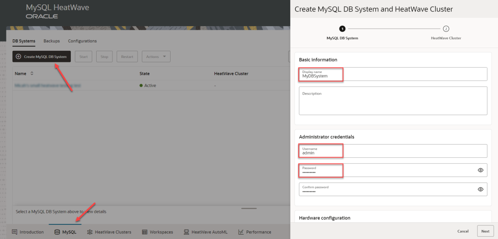
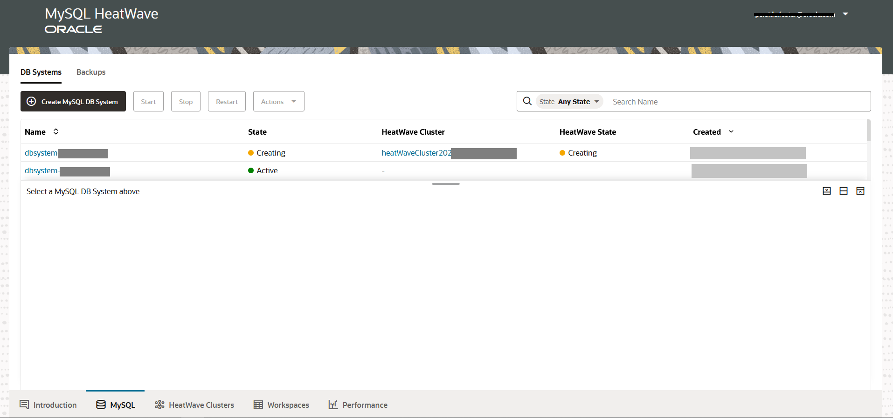

# Create MySQL Database HeatWave  and Cluster

## Introduction

You can access MySQL HeatWave on AWS using the MySQL HeatWave Console (a browser-based interface).

If you have not yet registered for MySQL HeatWave on AWS, you must do that first. See Section 2.2, “Signing Up”. ???

After you sign up and create a DB System, you can access MySQL HeatWave on AWS from a MySQL client or application. A MySQL user account is required.

In this lab, you will create and configure a new DB System. A HeatWave Cluster is created by default when creating a DB System.

_Estimated Time:_ 20 minutes

### Objectives

In this lab, you will be guided through the following tasks:

- Login to MySQL Database Service console page
- Create MySQL Database for HeatWave

### Prerequisites

- An Oracle Trial or Paid Cloud Account
- Some Experience with MySQL Shell

## Task 1: Login to MySQL Database Service console page

1. Log on to MySQL Database Service Console
    1.1. On your web browser, go to:

    ```bash
    <copy>https://cloud.mysql.com</copy>
    ```

2. Enter the provided username and password to sign in to the page. NOTE: These are the Basic Authentication Credentials provided to you for the Beta program. Do not confuse these with your personal credentials. These credentials grant access to the site and this only applies for the beta testing.

    

3. Enter the provided Cloud Account Name. This is the MySQL HeatWave OCI Cloud
    Account Name that was provided to you.

    

4. Enter the provided OCI account credential. This is your email address and the password that was provided to you

    

5. Once you are logged on, you will see the MySQL Database Service console page:

    

## Task 2: Create MySQL Database for HeatWave

1. In the MySQL HeatWave Console, select the MySQL tab
2. On the DB Systems panel, click Create MySQL DB System to open the Create MySQL DB System and HeatWave Cluster dialog
3. Provide the Basic information for the DB System:
    - **Display Name**: Specify a display name for the DB system or use the generated default name.
    - **Description**: Specify a user-friendly description of the DB System.
4. Specify the Administrator credentials for the MySQL DB System.
    - Username: Specify a user name for the MySQL Administrator user (1 to 32 characters). The MySQL Administrator user is granted a specific set of MySQL Server privileges. For more information, see Default MySQL Privileges.

    **Note** Certain names are reserved and cannot be used. See Reserved User Names.

    - Password: Specify a MySQL Administrator password. The password must be 8 to 32 characters including at least one number, one uppercase letter, one lowercase letter, and one special (nonalphanumeric) character.

    - Confirm Password: Re-enter the MySQL Administrator password.

    

5. Select the Hardware shape.
    - **Shape**: Select the shape to use for your DB system. The shape determines the resources allocated to the system. For information about shapes, see Supported Shapes. Selecting a MySQL shape for a DB System also selects the configuration associated with that shape. See Chapter 11, Configuration.
    - **Data Storage Size (GiB)**: Specify the amount of block storage, in GiB, to allocate to the DB System. This block storage stores all data, logs, and temporary files. Binaries are not stored in this block storage. The maximum storage allocation is 16384 GiB.
    - **Database Version**: Select the MySQL Server version you want to deploy. The latest MySQL Server version is selected by default.
    - **Maintenance Window**: Select the start time for the maintenance window, which is a two-hour period. When updates are available, they are initiated during this window. The time required to apply patches and updates may extend beyond the maintenance window and require DB System restarts. For more information, see Chapter 14, Maintenance.
        - Select Automatic to have a maintenance window Start day and Start time chosen for you.
        - Select Manual to specify your own maintenance window Start day and Start time. Time is specified in Coordinated Universal Time (UTC).

            **Note** You can modify the Maintenance Window later by editing the DB System.

6. Configure the Availability zone, which determines the physical location of the DB System:
    - Select Automatic to have the physical AWS Availability Zone selected for you.
    - Set Manual to select the physical AWS Availability Zone where the DB System will be created.

 
7. Configure Networking settings:

    - **Allowed Client Addresses**: Specify the public-facing client IPv4 addresses that are permitted to connect to the DB System endpoint. These must all be public IP addresses (capable of accessing the Internet), not private IP addresses. For example, you might want to include any of the following:

    - The public IP address for the system you are using to set up MySQL HeatWave on AWS
    - The public IP address for a system that will be used by an administrator to manage the HeatWave Cluster
    - The public IP addresses of application servers where client applications that will use the HeatWave Cluster are running
    - A public IP address range assigned to your organization

The IP addresses are specified in CIDR format; for example: 1.2.3.4/24. Multiple addresses in CIDR format can be specified in a semicolon-separated list; for example: 1.2.3.4/24; 1.2.3.4/32.

    

3. Hardware: Specify the Database Storage Size

4. Availability Zone: Auto Placement is on by default. If you want to specify an available zone to place the MySQL DB System, turn it off and select the AZ

    

5. Endpoint:

    5.1 Allowed Client Addresses: Specify IP range(s) of your client IP addresses, which you will use to access the MySQL DB System instance in the steps later. Multiple CIDR ranges can be specified via a semi-colon separated list in the form of xxx.xxx.xxx.xxx/yy;xxx.xxx.xxx.xxx/yy;…

    **Note** that 0.0.0.0/0 is not supported at this time.

    5.2 Port: 3306

    5.3 X Plugin Port: 33060

6. Setup HeatWave Cluster(s)

    

7. Press “Create” to create the DB System

    

8. Once the instance is created, click to see the detailed information such as Host Name. You will use the Host Name to connect to the instance.

    

## Acknowledgements

- **Author** - Perside Foster, MySQL Solution Engineering

- **Contributors** - Mandy Pang, Principal Product Manager,
Nick Mader, MySQL Global Channel Enablement & Strategy Manager
- **Last Updated By/Date** - Perside Foster, MySQL Solution Engineering, September 2022
