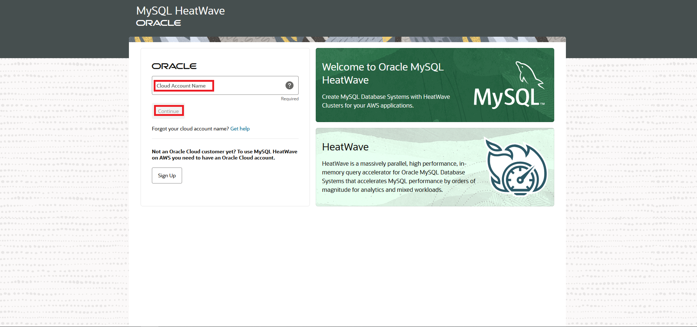
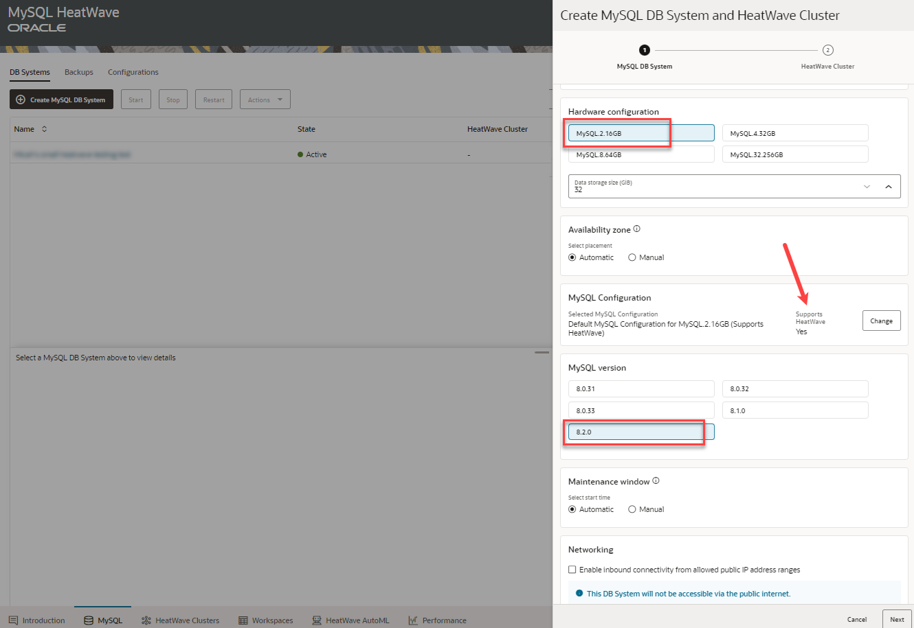

# Create MySQL Database HeatWave  and Cluster

## Introduction

You can access MySQL HeatWave on AWS using the MySQL HeatWave Console (a browser-based interface).

If you have not yet registered for MySQL HeatWave on AWS, you must do that first.

After registering, create a DB System with an admin MySQL user account. A HeatWave Cluster is created by default when creating a DB System. Using the newly created MySQL user account, you can access MySQL HeatWave on AWS from a MySQL client or application.

_Estimated Time:_ 10 minutes

### Objectives

In this lab, you will be guided through the following tasks:

- Login to MySQL Database Service console page
- Create MySQL Database for HeatWave

### Prerequisites

- An Oracle Trial or Paid Cloud Account
- Some Experience with MySQL Shell

## Task 1: Login to MySQL Database Service console page

1. Log on to MySQL Database Service Console
    1.1. On your web browser, go to:

    ```bash
    <copy>https://cloud.mysql.com</copy>
    ```

2. Enter the provided username and password to sign in to the page. NOTE: These are the Basic Authentication Credentials provided to you for the Beta program. Do not confuse these with your personal credentials. These credentials grant access to the site and this only applies for the beta testing.

    

3. Enter the provided Cloud Account Name. This is the MySQL HeatWave OCI Cloud
    Account Name that was provided to you.

    

4. Enter the provided OCI account credential. This is your email address and the password that was provided to you

    

5. Once you are logged on, you will see the MySQL Database Service console page:

    

## Task 2: Create MySQL Database for HeatWave

1. On the DB Systems Console, click “Create MySQL DB System” button
2. On the “Create MySQL DB System” panel
    2.1 Display Name: Enter a name for the DB System

    

    2.2 Description: Enter a description
    2.3 Administration credentials: Enter an administrative username and password for the MySQL database. These credentials allow access to the MySQL Database System. Make sure to save them, you will need them later to access the MySQL Database System via tools like MySQL Shell.

    

    2.4 Hardware: Specify the Database Storage Size
    2.5 Availability Zone: Auto Placement is on by default. If you want to specify an available zone to place the MySQL DB System, turn it off and select the AZ

    

    2.6 Endpoint:
    2.6.1 Allowed Client Addresses: Specify IP range(s) of your client IP addresses, which you will use to access the MySQL DB System instance in the steps later. Multiple CIDR ranges can be specified via a semi-colon separated list in the form of xxx.xxx.xxx.xxx/yy;xxx.xxx.xxx.xxx/yy;…
    Note that 0.0.0.0/0 is not supported at this time.
    2.6.2 Port: 3306
    2.6.3 X Plugin Port: 33060
    Setup HeatWave Cluster(s)

    

    2.7 Press “Create” to create the DB System

    

3. Once the instance is created, click to see the detailed information such as Host Name. You will use the Host Name to connect to the instance.

    


## Acknowledgements

- **Author** - Perside Foster, MySQL Solution Engineering

- **Contributors** - Mandy Pang, Principal Product Manager,
Nick Mader, MySQL Global Channel Enablement & Strategy Manager
- **Last Updated By/Date** - Perside Foster, MySQL Solution Engineering, September 2022
