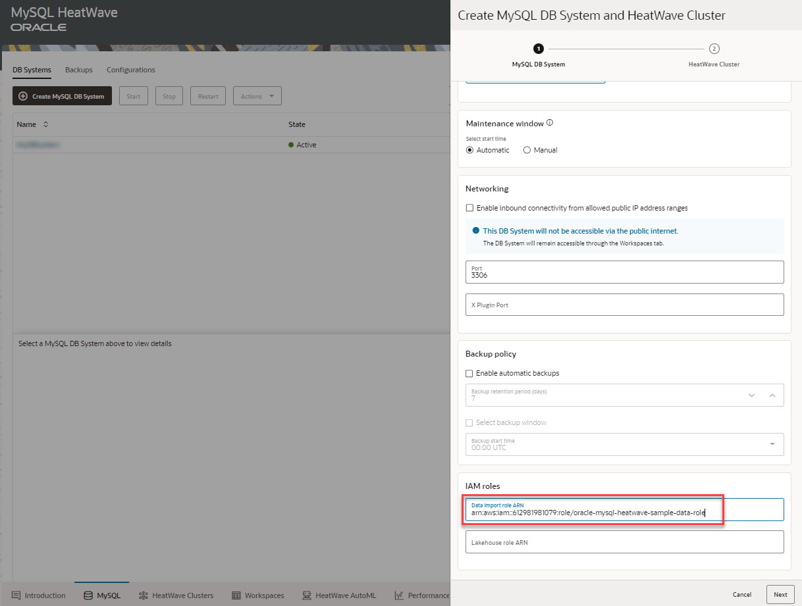
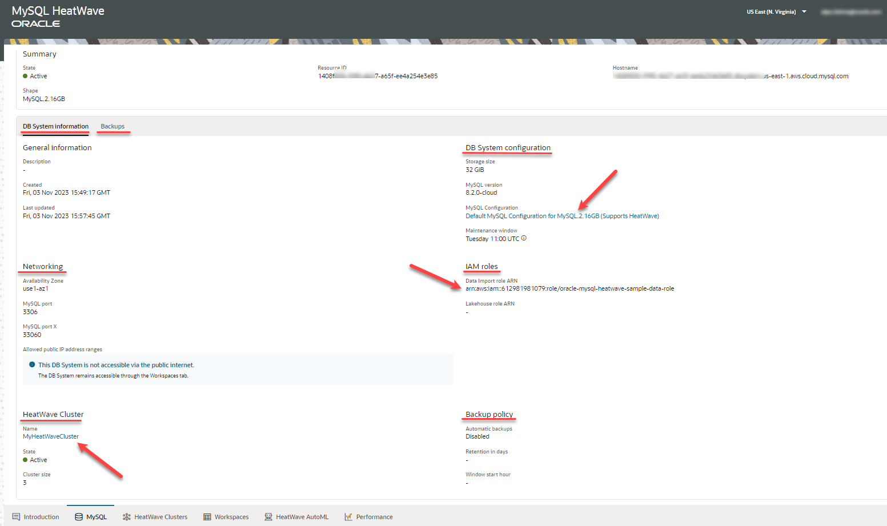

# Create MySQL Database HeatWave and Cluster

## Introduction

You can access MySQL HeatWave on AWS using the MySQL HeatWave Console (a browser-based interface).

If you have not yet registered for MySQL HeatWave on AWS, you must do that first.

After registering, create a DB System with an admin MySQL user account. A HeatWave Cluster is created by default when creating a DB System. Using the newly created MySQL user account, you can access MySQL HeatWave on AWS from a MySQL client or application.

_Estimated Time:_ 15 minutes

### Objectives

In this lab, you will be guided through the following tasks:

- Login to MySQL Database Service console page
- Create MySQL Database for HeatWave and Cluster

### Prerequisites

- A MySQL HeatWave on AWS Trial or Paid Cloud Account

## Task 1: Signin to MySQL Database Service console page

1. If you are a first-time user, follow the  [Sign Up](https://dev.mysql.com/doc/heatwave-aws/en/heatwave-aws-sign-procedure.html) instructions.

2. Go to the [MySQL HeatWave Console](https://cloud.mysql.com). 

3. Enter your Cloud Account Name then hit the **Continue** button
    

4. Enter the OCI account credential. This is your email address and the passwordthen hit the **Sign In** button
    

5. Once you are logged in, you will see the MySQL HeatWave Page. Hit the **Create MySQL DB System** button
    

## Task 2: Create MySQL Database for HeatWave

1. Create a MySQL DB system, which is the logical container for MySQL instances, and note the administrator username and password as you will need it to connect to the DB System

    

2. Select a shape of the DB System. A shape determines the number of OCPUs, amount of memory, and other resources that are allocated within a DB system. Each shape can have a couple of configurations. Ensure that you select a configuration that supports HeatWave.

    - You have the flexibility to select an innovation (8.1.0, 8.2.0, and so on) or a bug fix (8.0.32, 8.0.33, and so on) MySQL version as per your application and environment needs. The innovation releases contain the latest features and improvements, and the bug fix releases contain only necessary fixes, so they reduce the risks associated with changes in the database software's behavior. Both releases are production-grade quality.

    

3. We will later import sample data from Amazon S3 into this DB System. To be able to import data to a DB System later, specify an IAM role with correct policies and trust relationships required to access Amazon S3. The IAM role grants exclusive access to the data on Amazon S3 to specific MySQL HeatWave DB Systems, providing tighter security, which is suited for enterprise production workloads.

    - Oracle has pre-created an IAM role with required policies and permissions. Copy and paste the following code in the IAM roles field:

    ```bash
    <copy>arn:aws:iam::612981981079:role/oracle-mysql-heatwave-sample-data-role</copy>
    ```

    

4. Now we will provision a HeatWave cluster. You can select the HeatWave cluster size, that is, the number of HeatWave nodes present in the cluster. The cluster size depends on the tables and columns that are to be loaded into HeatWave, and the compression achieved in memory for this data. The maximum number of HeatWave nodes you can provision is 128.

    - Since we have not imported data to the DB System yet, we can select the cluster size as 1. After you have imported data into the DB System, you can estimate the cluster size using MySQL Autopilot. MySQL Autopilot utilizes advanced machine learning techniques to estimate optimal cluster size by adaptively sampling and analyzing the data on your MySQL DB System and recommends an appropriate cluster size.

    - Press the **Create** button to create the DB System.

    

5. The DB System build should complete in miuntes.

    

6. Once the instance is created, click to see the detailed information.

    

You may now **proceed to the next lab**

## Learn More

- [MySQL HeatWave on AWS Service Guiden](https://dev.mysql.com/doc/heatwave-aws/en/)

- [MySQL Database Documentation](https://dev.mysql.com/)


## Acknowledgements

- **Author** - Perside Foster, MySQL Solution Engineering
- **Contributors** - Mandy Pang, Senior Principal Product Manager, Aijaz Fatima, Product Manager
- **Last Updated By/Date** - Perside Foster, MySQL Solution Engineering, February 2024