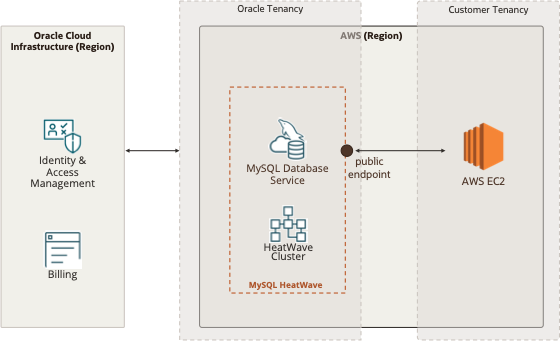

# Introduction

MySQL HeatWave is a massively parallel, high performance, in-memory query accelerator for MySQL Database Service that accelerates MySQL performance by orders of magnitude for analytics and mixed workloads. It is the only service that enables customers to run OLTP and OLAP workloads directly from their MySQL database without the need of ETL process. MySQL Autopilot uses advanced machine-learning techniques to automates the database lifecycle operations including provisioning, data loading, query processing, and error handling. This minimizes manual administrative work and further improves HeatWave’s usability, performance, and scalability

MySQL HeatWave is a massively parallel, high performance, in-memory query accelerator for MySQL Database Service that accelerates MySQL performance by orders of magnitude for analytics and mixed workloads. It is the only service that enables customers to run OLTP and OLAP workloads directly from their MySQL database without the need of ETL process. MySQL Autopilot uses advanced machine-learning techniques to automates the database lifecycle operations including provisioning, data loading, query processing, and error handling. This minimizes manual administrative work and further improves HeatWave’s usability, performance, and scalability

Below is an example of a MySQL HeatWave deployment.

## About this Workshop

This quick start guide provides step-by-step guide on creating and managing MySQL HeatWave on the MySQL console. For details on MySQL HeatWave functionalities, please refer to [MySQL HeatWave user guide] (https://dev.mysql.com/doc/heatwave/en/)

_Estimated Time:_ 2 hours

### About Product/Technology

HMySQL HeatWave is the only service that combines OLTP, analytics, machine learning, and machine learning-based automation within a single MySQL database. AWS users can now run transaction processing, analytics, and machine learning workloads in one service, without requiring time-consuming ETL duplication between separate databases such as Amazon Aurora for transaction processing and Amazon Redshift or Snowflake on AWS for analytics and SageMaker for machine learning

### Objectives

In this lab, you will be guided through the following steps:

- Create MySQL HeatWave Cluster
- Access your MySQL DB System
- Load Sample TPCH Data to MySQL DB System
- Provision HeatWave Cluster
- Run TPCH Queries on HeatWave Cluster in Workspaces
- Load sample data to HeatWave Cluster
- Run queries in HeatWave Cluster
- Monitor HeatWave performance
- Test MySQL HeatWave with Your Own Data
- Migrate Data from on-premise MySQL to MySQL HeatWave
- Import MySQL-compatible CSV formatted Data to MySQL HeatWave
- Load Data to HeatWave Cluster

### Prerequisites

Before you begin using MySQL HeatWave, please make sure you have the following
information from the MySQL HeatWave team:

1. MySQL HeatWave OCI Cloud Account Name
2. Web Console Basic Authentication Credentials. These credentials grant you access to the
site while it is still in Beta. They should have been provided to you from the …
3. User Credentials to log on to mysqlheatwave.com. You should have provided your email address to the MySQL HeatWave team for the user account creation. Your email address will be used as the login username, and the password should be provided to you from the MySQL HeatWave team.

## Acknowledgements

- **Author** - Perside Foster, MySQL Solution Engineering

- **Contributors** - Mandy Pang, Principal Product Manager,
Nick Mader, MySQL Global Channel Enablement & Strategy Manager
- **Last Updated By/Date** - Perside Foster, MySQL Solution Engineering, September 2022
