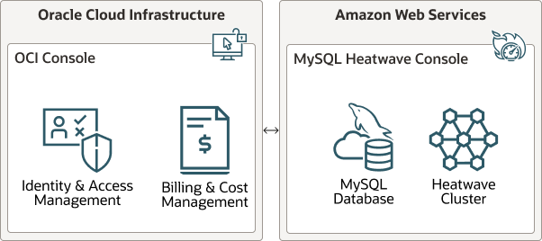

# Introduction

MySQL HeatWave on AWS is a fully managed service, developed and supported by the MySQL team at Oracle. Oracle automates tasks such as database and operating system patching. You are responsible for managing your data, schema designs, and access.

With MySQL HeatWave on AWS, you can create and manage a MySQL DB System with a HeatWave Cluster for your AWS applications.

The MySQL Database is built on the MySQL Enterprise Edition Server, which allows developers to quickly create and deploy secure cloud native applications using the world's most popular open source database.

HeatWave is a massively parallel, high performance, in-memory query accelerator that accelerates MySQL performance by orders of magnitude for analytics and mixed workloads. With MySQL HeatWave on AWS, you can provision DB Systems and HeatWave Clusters. When a HeatWave Cluster is enabled, queries that meet certain prerequisites are automatically offloaded from the MySQL DB System to the HeatWave Cluster for accelerated processing.

Below is an example of a MySQL HeatWave on AWS deployment.

## About this Workshop

This quick start guide provides step-by-step instructions on creating and managing  MySQL HeatWave on AWS. It covers registration, account management, user and group management, using the HeatWave Console to create and manage DB Systems and HeatWave Clusters, connecting, importing data, configuration, and performance monitoring.

_Estimated Time:_ 2 hours

### About Product/Technology

MySQL HeatWave on AWS is integrated with Oracle Cloud Infrastructure (OCI) for identity and access management, and for billing and cost management.

When you sign up for MySQL HeatWave on AWS, you are directed to OCI where you must sign up for an Oracle Cloud Account if you do not have one. After signing up, you are directed to the OCI Console to complete the sign-up process. When signing in to the MySQL HeatWave Console, you are seamlessly directed to OCI for authentication and then back to the MySQL HeatWave Console.

Identity & access management and billing for MySQL HeatWave on AWS is managed in OCI. For more information, see Billing.

The following diagram illustrates MySQL HeatWave on AWS integration with Oracle Cloud Infrastructure (OCI).

### Objectives

In this lab, you will be guided through the following steps:

- Create MySQL HeatWave and Cluster
- Connect to and Load your MySQL DB System
- Provision HeatWave Cluster
- Run queries in HeatWave Cluster
- Monitor HeatWave

### Prerequisites

Before you begin using MySQL HeatWave, please make sure you have the following
information from the MySQL HeatWave team:

1. MySQL HeatWave OCI Cloud Account Name
2. Web Console Basic Authentication Credentials. These credentials grant you access to the
site while it is still in Beta. They should have been provided to you from the …
3. User Credentials to log on to mysqlheatwave.com. You should have provided your email address to the MySQL HeatWave team for the user account creation. Your email address will be used as the login username, and the password should be provided to you from the MySQL HeatWave team.

## Acknowledgements

- **Author** - Perside Foster, MySQL Solution Engineering

- **Contributors** - Salil Pradhan, Product Manager, Samuel Rodrigues, Cloud Solution Engineer
- **Last Updated By/Date** - Perside Foster, MySQL Solution Engineering, October 2022
