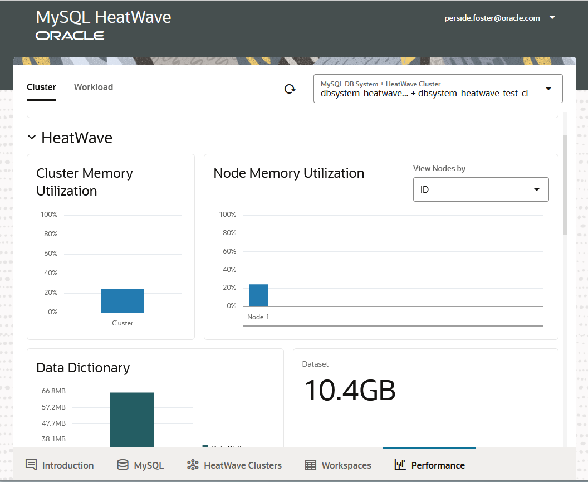
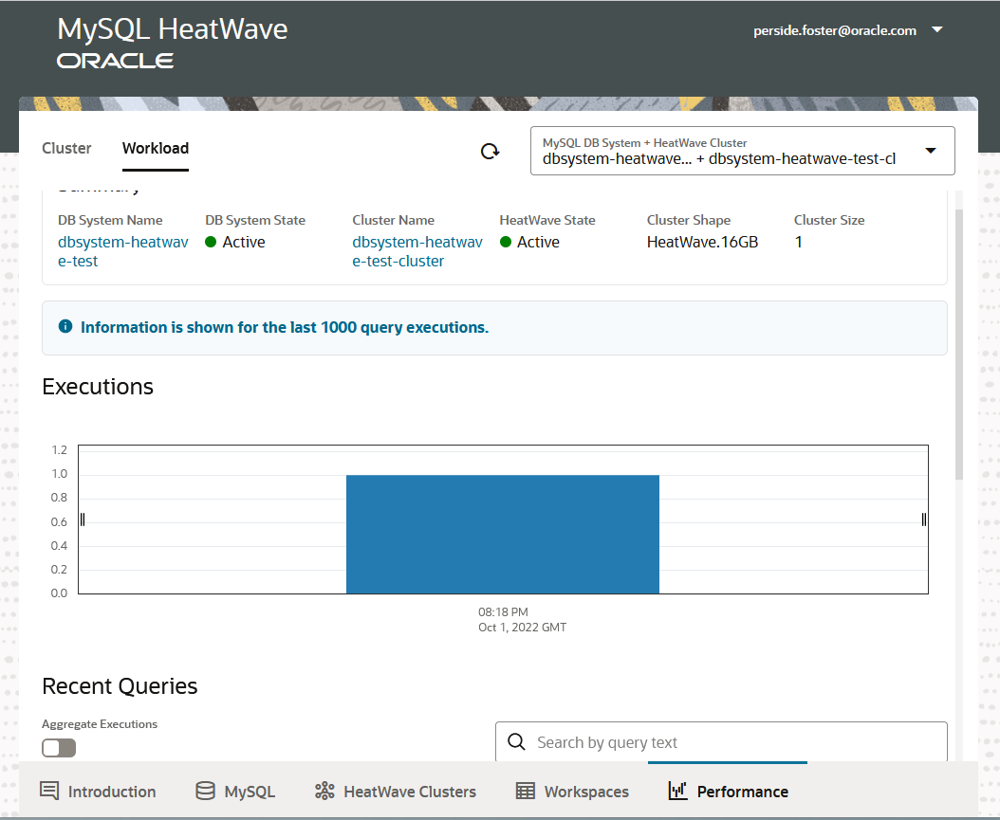

# Monitor HeatWave

## Introduction

The Performance tab in the MySQL HeatWave Console provides HeatWave Cluster and Workload
performance data. An active HeatWave Cluster is required for cluster and workload performance
monitoring.

_Estimated Time:_ 10 minutes

### Objectives

In this lab, you will be guided through the following task:

- ????

### Prerequisites

- An Oracle Trial or Paid Cloud Account
- Some Experience with MySQL Shell
- Completed Lab 4

## Task 1: Monitor HeatWave Performance

You can monitor HeatWave performance on the “Performance” tab on the web console.
MySQL and HeatWave Cluster performance:

Query monitoring and performance:

## Test MySQL HeatWave with Your Own Data

Migrate Data from on-premise MySQL to MySQL HeatWave
If you are migrating data from on-premise MySQL to MySQL HeatWave, we recommend that
you use MySQL Shell Dump and Load utility.

1. To dump data from on-premise MySQL: 

    [Dump Date](https://dev.mysql.com/doc/mysqlshell/8.0/en/mysql-shell-utilities-dump-instance-schema.html)

2. To load data to MySQL Database/HeatWave:
    [Load Date](https://dev.mysql.com/doc/mysqlshell/8.0/en/mysql-shell-utilities-load-dump.html)

## Import MySQL-compatible CSV formatted Data to MySQL HeatWave

1. Import data to MySQL

    We recommend using MySQL Shell - Parallel Table Import Utility to import the data to
    MySQL. For more details on Parallel Table Import Utility, go
    here: 
        [Dump Date](https://dev.mysql.com/doc/mysql-shell/8.0/en/mysql-shell-utilities-paralleltable.html)

    **RECOMMENDATIONS:** Remove any indexes from your table schema to speed up data import
    speed. MySQL HeatWave does not require indexes to speedup query processing.

2. Load Data to HeatWave Cluster

    Once data is imported in MySQL, you are ready to load data to HeatWave cluster. Please refer to
    section Load sample data to HeatWave Cluster

3. Run Queries on HeatWave Cluster

    Similar to the example above, you can use EXPLAN PLAN to check if a query will be offloaded
    to HeatWave Cluster: Run Queries on HeatWave Cluster  

## Learn More

- [Oracle Cloud Infrastructure MySQL Database Service Documentation](https://docs.cloud.oracle.com/en-us/iaas/MySQL-database)

- [MySQL Database Documentation](https://www.MySQL.com)

## Acknowledgements

- **Author** - Perside Foster, MySQL Solution Engineering

- **Contributors** - Salil Pradhan, Product Manager, Samuel Rodrigues, Cloud Solution Engineer
- **Last Updated By/Date** - Perside Foster, MySQL Solution Engineering, October 2022
