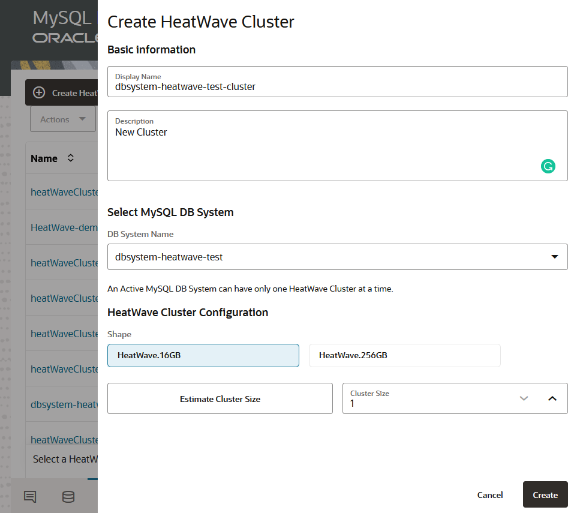
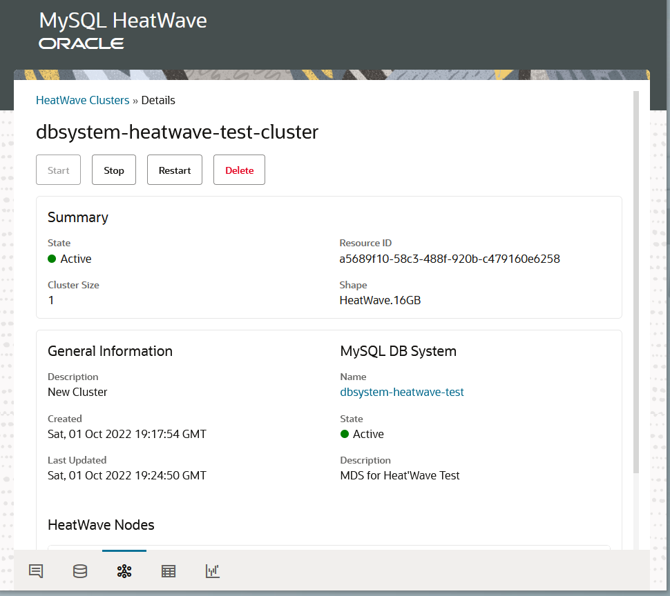
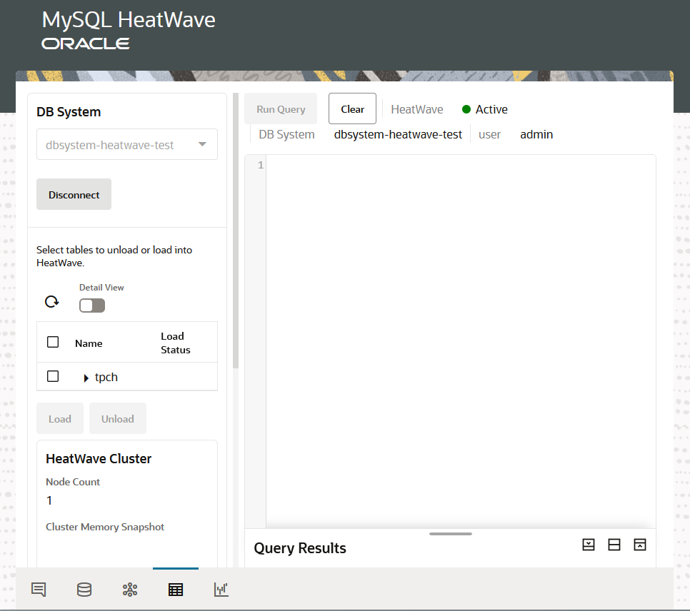
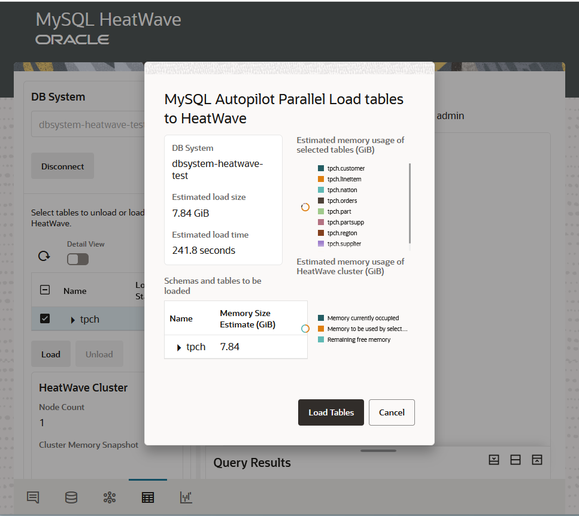
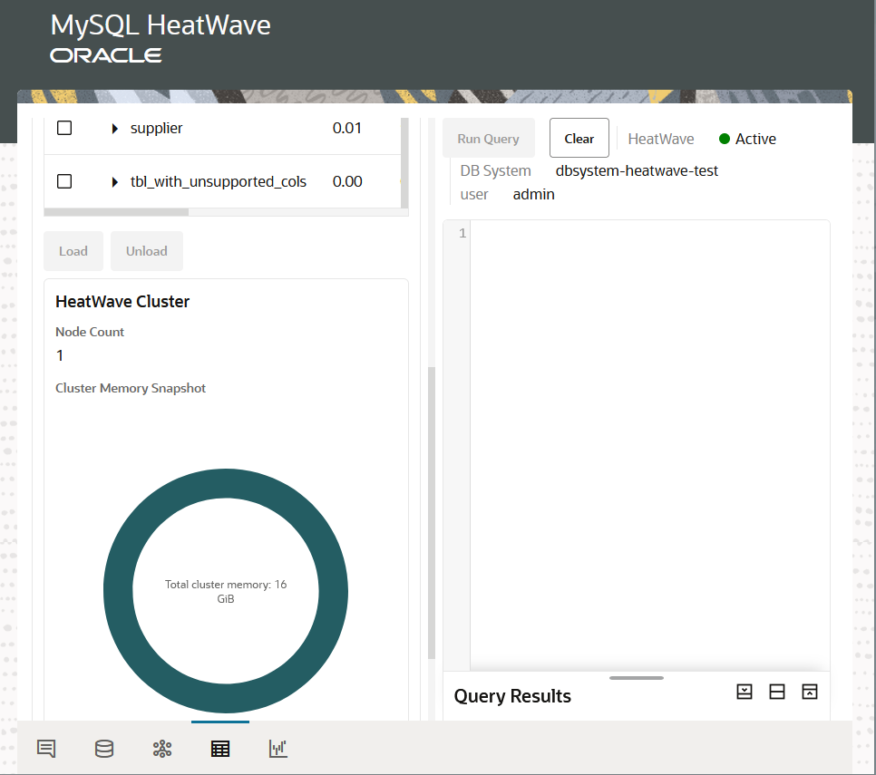

# Provision HeatWave Cluster 

## Introduction

A HeatWave Cluster consists of a MySQL DB System and one or more HeatWave nodes. The MySQL DB
System includes a HeatWave plugin that is responsible for cluster management, query scheduling, and returning query results to the MySQL DB System. HeatWave nodes store data in memory and process queries. When a HeatWave Cluster is enabled and data is loaded, queries that meet certain prerequisites are automatically offloaded from the MySQL DB System to the HeatWave Cluster for accelerated processing

_Estimated Time:_ 10 minutes

### Objectives

In this lab you will create and manage your HeatWave Cluster and Nodes.

### Prerequisites

- An Oracle Trial or Paid Cloud Account
- Some Experience with MySQL Shell
- Completed Lab 2

## Task 1: Create Cluster

1. On the MySQL DB System web console, go to the “HeatWave Clusters” tab
2. Press “Create HeatWave Cluster” button
3. On the “Create HeatWave Cluster” panel, enter:

    a. Display Name

    b. Description

    c. Select the MySQL DB System that you created in the previous step from the dropdown
list.

    d. Select the cluster size (minimum of 2 nodes).
    NOTE: for beta testing, each HeatWave node can handle ~200GB of data. If you have
    500GB of data, you will need 3 HeatWave nodes

4. Press “Create”

    

5. Click the created HeatWave cluster to see the details

    

## Task 2: Load sample data to HeatWave Cluster from Workspaces

Before you can run queries in HeatWave, you need to first load the data from MySQL to
HeatWave. You can use “Workspaces” on the console to load data and run queries in HeatWave.

1. Load sample data to HeatWave Cluster

    a. Go to “Workspaces” tab on the web console

    b. Select the DB System that you want to connect to, enter the admin user credentials, and click “Connect”

    

    c. Select the tpch database on the left panel and press “Load” to load tables to HeatWave

    d. Press “Confirm Load” to load the data to HeatWave

    

    e. Once the tables are loaded, you are ready to run queries in the Workspaces

    

## Learn More

- [Oracle Cloud Infrastructure MySQL Database Service Documentation](https://docs.cloud.oracle.com/en-us/iaas/MySQL-database)

- [MySQL Database Documentation](https://www.MySQL.com)

## Acknowledgements

- **Author** - Perside Foster, MySQL Solution Engineering

- **Contributors** - Salil Pradhan, Product Manager, Samuel Rodrigues, Cloud Solution Engineer
- **Last Updated By/Date** - Perside Foster, MySQL Solution Engineering, October 2022
