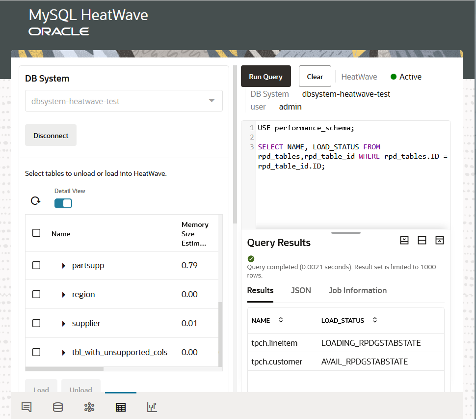

# Run queries in HeatWave Cluster

## Introduction

In this lab you will use the  MySQL HeatWave Console Query Editor to running MySQL and
HeatWave queries.
Note

_Estimated Time:_ 10 minutes

### Objectives

In this lab, you will be guided through the following task:

- Run Test Queries Iin HeatWave Cluster
- Compare TPCH query performance with MySQL

### Prerequisites

- An Oracle Trial or Paid Cloud Account
- Some Experience with MySQL Shell
- Completed Lab 3

## Task 1: Run Test Queries In HeatWave Cluster

You can run the  queries in the Query Editor in Workspaces

To confirm that the TPCH data has been loaded into the HeatWave Cluster, run the following select command:

```bash
<copy>SELECT VARIABLE_VALUE FROM performance_schema.global_status WHERE VARIABLE_NAME = 'rapid_load_progress';</copy>  
```



Here are a few TPCH queries:

1. Q1

    ```bash
    <copy>SELECT
        l_returnflag,
        l_linestatus,
        SUM(l_quantity) AS sum_qty,
        SUM(l_extendedprice) AS sum_base_price,
        SUM(l_extendedprice * (1 - l_discount)) AS sum_disc_price,
        SUM(l_extendedprice * (1 - l_discount) * (1 + l_tax)) AS
        sum_charge,
        AVG(l_quantity) AS avg_qty,
        AVG(l_extendedprice) AS avg_price,
        AVG(l_discount) AS avg_disc,
        COUNT(*) AS count_order
        FROM
        tpch.lineitem
        WHERE
        l_shipdate <= DATE '1998-12-01' - INTERVAL '90' DAY
        GROUP BY l_returnflag , l_linestatus
        ORDER BY l_returnflag , l_linestatus; </copy>
    ```

2. Q2

    ```bash
    <copy>SELECT
            l_orderkey,
            SUM(l_extendedprice * (1 - l_discount)) AS revenue,
            o_orderdate,
            o_shippriority
            FROM
            tpch.customer,
            tpch.orders,
            tpch.lineitem
            WHERE
            c_mktsegment = 'BUILDING'
            AND c_custkey = o_custkey
            AND l_orderkey = o_orderkey
            AND o_orderdate < DATE '1995-03-15'
            AND l_shipdate > DATE '1995-03-15'
            GROUP BY l_orderkey , o_orderdate , o_shippriority
            ORDER BY revenue DESC , o_orderdate
            LIMIT 10; </copy>
    ```

3. Q3

    ```bash
    <copy>SELECT
            SUM(l_extendedprice * l_discount) AS revenue
            FROM
            tpch.lineitem
            WHERE
            l_shipdate >= DATE '1994-01-01'
            AND l_shipdate < DATE '1994-01-01' + INTERVAL '1' YEAR
            AND l_discount BETWEEN 0.06 - 0.01 AND 0.06 + 0.01
            AND l_quantity < 24;</copy>
    ```

4. To get the full list of queries, go to:
        [HeatWave](https://github.com/oracle/heat)

    **Note**

    1. If the query can be offloaded to MySQL HeatWave, you will see "Using secondary
    engine RAPID" in the explain statement (prepend the query with “EXPLAIN” and run
    the query).

    2. The Query Editor can run multiple sql statements, but only the result of the last sql
    statement is returned

    3. Each run in the query editor is a new session.

## Task 2: Compare TPCH query performance with MySQL


## Learn More

* [Oracle Cloud Infrastructure MySQL Database Service Documentation ](https://docs.cloud.oracle.com/en-us/iaas/MySQL-database)
* [MySQL Database Documentation](https://www.MySQL.com)

## Acknowledgements

- **Author** - Perside Foster, MySQL Solution Engineering

- **Contributors** - Salil Pradhan, Product Manager, Samuel Rodrigues, Cloud Solution Engineer
- **Last Updated By/Date** - Perside Foster, MySQL Solution Engineering, October 2022
