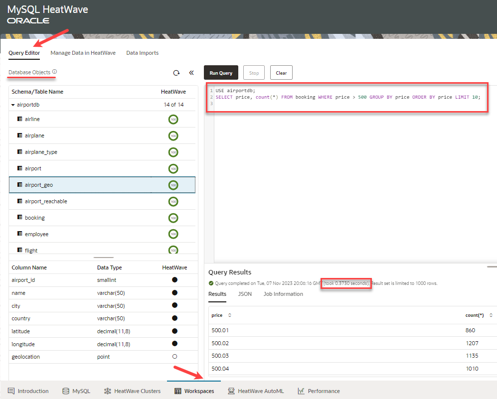
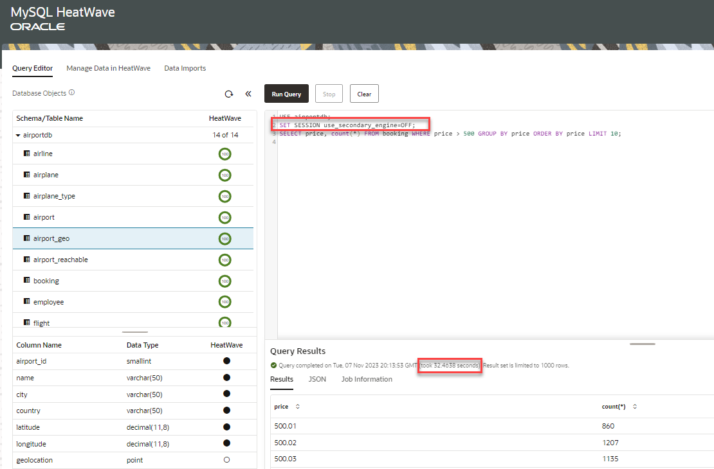

# Run Queries in HeatWave

## Introduction

MySQL HeatWave console provides a Query Editor to ease your interaction with the DB system eliminating the need to go back and forth between the Console and an external MySQL client for resource and data management.

_Estimated Time:_ 10 minutes

### Objectives

In this lab, you will be guided through the following task:

- Run queries with  HeatWave turned on.
- Run queries with  HeatWave turned off.

### Prerequisites

- Must complete Lab 2

## Task 1: Run queries with HeatWave turned on

On the Query Editor, under Database Objects, you can see the schemas and tables in the MySQL DB System, the associated table definitions, and the HeatWave load status of each table.

Once the tables are loaded into HeatWave, you can run a query on HeatWave by performing the following steps:

1. Click the **Query Editor** tab.
2. Enter the following query in the query editor:

    ```bash
    <copy>USE airportdb;
    SELECT price, count(*) FROM booking WHERE price > 500 GROUP BY price ORDER BY price LIMIT 10;</copy> 
    ```

3. Click the **Run Query** button to execute the query.

    When you run the query with HeatWave, it took only 0.3730 seconds.

    

## Task 2: Run queries with HeatWave turned on

Let us run the same query by turning off HeatWave to find out what query performance we get with HeatWave. Perform the following steps:

1. Enter the following query in the query editor:

    ```bash
    <copy>USE airportdb; 
    SET SESSION use_secondary_engine=OFF; 
    SELECT price, count(*) FROM booking WHERE price > 500 GROUP BY price ORDER BY price LIMIT 10;</copy> 
    ```

2. Click the **Run Query** button to execute the query.

    When you run the query without HeatWave, it took 32.4638 seconds, which means that HeatWave executed this query many times faster.

    

You may now **proceed to the next lab**.

## Learn More

- [MySQL HeatWave on AWS Service Guiden](https://dev.mysql.com/doc/heatwave-aws/en/)

- [MySQL Database Documentation](https://dev.mysql.com/)

## Acknowledgements

- **Author** - Perside Foster, MySQL Solution Engineering
- **Contributors** - Mandy Pang, Senior Principal Product Manager, Aijaz Fatima, Product Manager
- **Last Updated By/Date** - Perside Foster, MySQL Solution Engineering, February 2024
